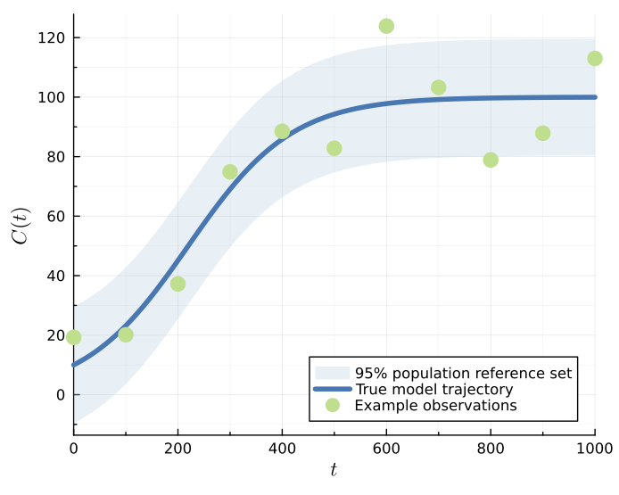
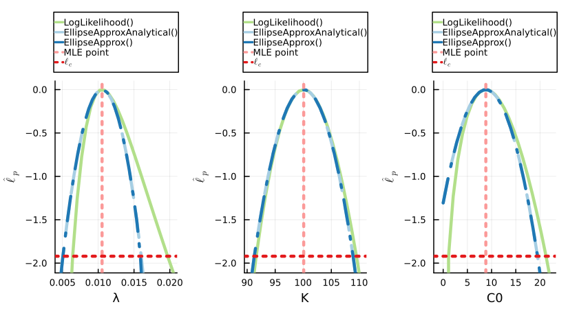
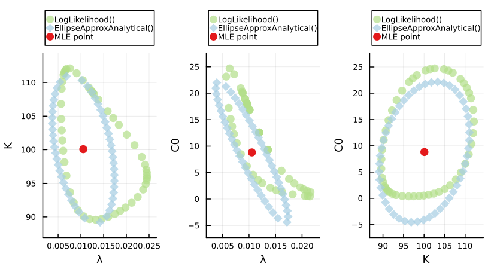
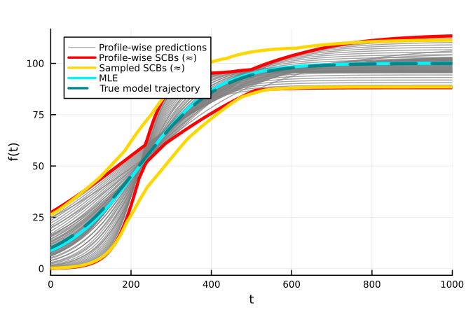
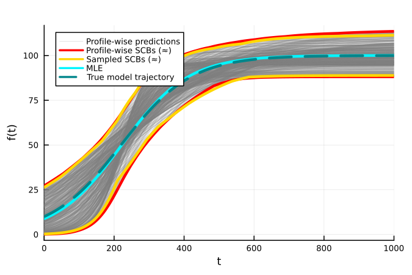
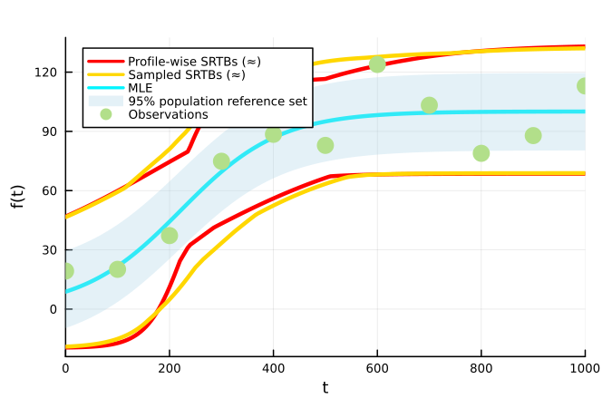
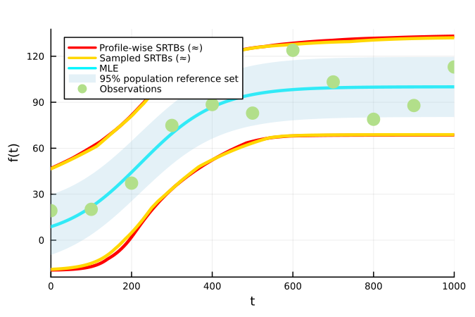

# Logistic Model

The code included in this example is compiled into a single file [here](../../../examples/logistic.jl).

The logistic model with a normal data distribution [simpsonprofilewise2023](@cite) has the following differential equation for the population density ``C(t)\geq0``:
```math
\frac{\mathrm{d}C(t)}{\mathrm{d}t} = \lambda C(t) \Bigg[1-\frac{C(t)}{K}\Bigg],
```
where the model parameter vector is given by ``\theta^M = (\lambda, K, C(0))``. The corresponding additive Gaussian data distribution, with a fixed standard deviation, has a density function for the observed data given by:
```math
y_i \sim p(y_i ; \theta) \sim \mathcal{N}(z_i(\theta^M), \sigma^2),
```
where ``z_i(\theta^M)=z(t_i; \theta^M)`` is the model solution of the first Equation at ``t_i`` and ``\sigma=10``.

The true parameter values are ``\theta^M =(0.01, 100, 10)``. The corresponding lower and upper parameter bounds are ``a = (0, 50, 0)`` and ``b = (0.05,150,50)``. Observation times are ``t_{1:I} = 0,100,200,...,1000``. The original implementation can be found at [https://github.com/ProfMJSimpson/Workflow](https://github.com/ProfMJSimpson/Workflow). Example realisations, the true model trajectory and 95% population reference set under this parameterisation can be seen in the figure below:



## Initial Setup

Here we add three worker processes, which matches the number of univariate and bivariate profiles. For coverage testing we recommend setting this number as discussed in [Import Package and Set Up Distributed Environment](@ref). 

```julia
using Distributed
if nprocs()==1; addprocs(3, env=["JULIA_NUM_THREADS"=>"1"]) end
@everywhere using Random, Distributions
@everywhere using LikelihoodBasedProfileWiseAnalysis
using Combinatorics
```

## Model and Likelihood Function Definition

```julia
@everywhere function solvedmodel(t, θ)
    return (θ[2]*θ[3]) ./ ((θ[2]-θ[3]) .* (exp.(-θ[1] .* t)) .+ θ[3])
end

@everywhere function loglhood(θ, data)
    y=solvedmodel(data.t, θ)
    e=sum(loglikelihood(data.dist, data.y_obs .- y))
    return e
end
```

## Initial Data and Parameter Definition

```julia
# true parameters
λ_true=0.01; K_true=100.0; C0_true=10.0; t=0:100:1000; 
@everywhere global σ=10.0;
θ_true=[λ_true, K_true, C0_true]
y_true = solvedmodel(t, θ_true)
y_obs = [19.27, 20.14, 37.23, 74.87, 88.51, 82.91, 123.88, 103.25, 78.89, 87.87, 113.0]

# Named tuple of all data required within the log-likelihood function
data = (y_obs=y_obs, t=t, dist=Normal(0, σ))

# Bounds on model parameters 
λ_min, λ_max = (0.00, 0.05)
K_min, K_max = (50., 150.)
C0_min, C0_max = (0.0, 50.)
lb = [λ_min, K_min, C0_min]
ub = [λ_max, K_max, C0_max]

θnames = [:λ, :K, :C0]
θG = θ_true
par_magnitudes = [0.005, 10, 10]
```

## LikelihoodModel Initialisation

Here we choose to set some optimization settings, `opt_settings`, which are used when determining the maximum likelihood estimate ``\hat{\theta}``. If different settings are not provided to functions for profiling, then these settings (which are now contained in the [`LikelihoodModel`](@ref)), will be used.

```julia
opt_settings = create_OptimizationSettings(solve_kwargs=(maxtime=5,))
model = initialise_LikelihoodModel(loglhood, data, θnames, θG, lb, ub, par_magnitudes, optimizationsettings=opt_settings)
```

## Full Parameter Vector Confidence Set Evaluation

To evaluate the full parameter vector confidence set at a 95% confidence level we use:

```julia
full_likelihood_sample!(model, 30000, use_distributed=true)
```

## Profiling

### Univariate Profiles

To find the confidence intervals for all three parameters at a 95% confidence level (the default), we use:

```julia
univariate_confidenceintervals!(model)
```

If we instead wish to find these intervals at a 99% confidence interval we use:

```julia
univariate_confidenceintervals!(model, confidence_level=0.99)
```

Similarly, if we wish to find simultaneous 95% confidence intervals for the parameters we set the degrees of freedom to the number of model parameters (instead of `1`).

```julia
univariate_confidenceintervals!(model, dof=model.core.num_pars) # model.core.num_pars=3
```

To find asymptotic confidence intervals using the ellipse approximation, we change the specified profile type to [`EllipseApproxAnalytical`](@ref) or [`EllipseApprox`](@ref). When parameter constraints are not in the way these will produce the same result for well-identified models:

```julia
univariate_confidenceintervals!(model, profile_type=EllipseApproxAnalytical())
univariate_confidenceintervals!(model, profile_type=EllipseApprox())
```

If we want to visualise the univariate profiles across the range defined by each confidence interval then we need to evaluate points inside each interval. We can also evaluate some points to the left and right of each interval to observe the behaviour of the profile log-likelihood function outside of this range:

```julia
get_points_in_intervals!(model, 20, additional_width=0.2)
```

This can also be done within [`univariate_confidenceintervals`](@ref) using the `num_points_in_interval` and `additional_width` keyword arguments.

#### Initial Guesses

We can use existing confidence intervals to reduce the search bracket for other confidence intervals of interest. 

For example, we can use the confidence intervals found at a 99% confidence level with one degree of freedom to more quickly find the corresponding intervals at a 95% confidence level. We set `existing_profiles=:overwrite` so that we recalculate these profiles - otherwise they won't be calculated as they already exist!

```julia
univariate_confidenceintervals!(model, confidence_level=0.99)
univariate_confidenceintervals!(model, confidence_level=0.95, use_existing_profiles=true, 
    existing_profiles=:overwrite, num_points_in_interval=20, additional_width=0.2)
```

Similarly, we can use profiles of type [`EllipseApproxAnalytical`](@ref) to decrease the bracket. This is recommended for identifiable parameters.

```julia
univariate_confidenceintervals!(model, profile_type=EllipseApproxAnalytical())
univariate_confidenceintervals!(model, use_ellipse_approx_analytical_start=true, 
    existing_profiles=:overwrite, num_points_in_interval=20, additional_width=0.2)
```

### Bivariate Profiles

To evaluate the bivariate boundaries for all three bivariate parameter combinations, here we use the [`IterativeBoundaryMethod`](@ref), which uses a 20 point ellipse approximation of the boundary as a starting guess using [`RadialMLEMethod`](@ref). The boundaries in this example are reasonably convex, which makes this starting guess appropriate. To speed up computation we provide stronger optimization settings.

```julia
opt_settings = create_OptimizationSettings(solve_kwargs=(maxtime=5, xtol_rel=1e-12))
bivariate_confidenceprofiles!(model, 50, 
    method=IterativeBoundaryMethod(20, 5, 5, 0.15, 1.0, use_ellipse=true), 
    optimizationsettings=opt_settings)
```

Similarly, if we wish to evaluate simultaneous 95% bivariate profiles we set the degrees of freedom parameter, `dof`, to the number of model parameters (instead of `2`).

```julia
opt_settings = create_OptimizationSettings(solve_kwargs=(maxtime=5, xtol_rel=1e-12))
bivariate_confidenceprofiles!(model, 50, 
    method=IterativeBoundaryMethod(20, 5, 5, 0.15, 1.0, use_ellipse=true), 
    dof=model.core.num_pars,
    optimizationsettings=opt_settings)
```

To evaluate the analytical ellipse boundaries using [EllipseSampling](https://joeltrent.github.io/EllipseSampling.jl/stable) we use:

```julia
bivariate_confidenceprofiles!(model, 50, 
    profile_type=EllipseApproxAnalytical(), method=AnalyticalEllipseMethod(0.15, 1.0))
```

To efficiently sample 100 points within the bivariate boundaries using a rejection sampling approach we use:

```julia
sample_bivariate_internal_points!(model, 100)
```

### Plots of Profiles

To visualise plots of these profiles we load [Plots](https://docs.juliaplots.org/stable/) alongside a plotting backend. Here we use [GR](https://github.com/jheinen/GR.jl).

```julia
using Plots, Plots.PlotMeasures; gr()
Plots.reset_defaults(); Plots.scalefontsizes(0.75)
```

Univariate and bivariate profiles can either be visualised individually or in comparison to profiles at the same confidence level and degrees of freedom. 

Here we compare the univariate profiles formed at a 95% confidence level and 1 degree of freedom. The first two arguments scale the limits of the x and y axis, respectively, away from the found confidence interval at the specified threshold.
```julia
plts = plot_univariate_profiles_comparison(model, 0.1, 0.1,
    confidence_levels=[0.95], dofs=[1])

plt = plot(plts..., layout=(1,3),
    legend=:outertop, title="", dpi=150, size=(550,300), margin=1mm)
display(plt)
```



Similarly, here we compare the bivariate profiles formed at a 95% confidence level and 2 degrees of freedom.
```julia
plts = plot_bivariate_profiles_comparison(model, 0.1, 0.1, confidence_levels=[0.95], dofs=[2])

plt = plot(plts..., layout=(1,3),
    legend=:outertop, title="", dpi=150, size=(550,300), margin=1mm)
display(plt)
```



## Predictions

To make predictions for the model trajectory and the ``1-\delta`` population reference set we define the following functions, which then need to be added to our [`LikelihoodModel`](@ref). The `region` variable in `errorfunction` should be set equal to ``1-\delta`` when generating predictions. These could also be added in [`initialise_LikelihoodModel`](@ref).

```julia
@everywhere function predictfunction(θ, data, t=data.t); solvedmodel(t, θ) end
@everywhere function errorfunction(predictions, θ, region); normal_error_σ_known(predictions, θ, region, σ) end

add_prediction_function!(model, predictfunction)
add_error_function!(model, errorfunction)
```

To generate profile-wise predictions for each of the evaluated profiles we first define the desired time points for prediction and then evaluate the approximate model trajectory confidence sets and ``(1-\delta, 1-\alpha)`` population reference tolerance sets. By default, the population reference tolerance set evaluates reference interval regions at the same level as the default confidence level (``1-\delta = 1-\alpha = 0.95``); however, this is not required.

```julia
t_pred=0:5:1000

generate_predictions_univariate!(model, t_pred)
generate_predictions_bivariate!(model, t_pred)
generate_predictions_dim_samples!(model, t_pred) # for the full likelihood sample
```

### Plotting Predictions

We can plot the predictions of individual profiles or the union of all profiles at a given number of interest parameters, confidence level, degrees of freedom and reference interval region (if relevant). When plotting the union of these predictions we can compare it to the result of the full likelihood sample, which here used [`LatinHypercubeSamples`](@ref), the default. Here we plot the results from simultaneous profiles at a 95% confidence level.

#### Model Trajectory

SCBs ``(\approx)`` here refer to approximate simultaneous confidence bands for the true model trajectory.

```julia
using Plots, Plots.PlotMeasures; gr()
plt = plot_predictions_union(model, t_pred, 1, dof=model.core.num_pars,
    compare_to_full_sample_type=LatinHypercubeSamples(), title="") # univariate profiles

plot!(plt, t_pred, solvedmodel(t_pred, θ_true), 
    label="True model trajectory", lw=3, color=:turquoise4, linestyle=:dash,
    dpi=150, size=(450,300), rightmargin=3mm)
```



```julia
plt = plot_predictions_union(model, t_pred, 2, dof=model.core.num_pars,
    compare_to_full_sample_type=LatinHypercubeSamples(), title="") # bivariate profiles

plot!(plt, t_pred, solvedmodel(t_pred, θ_true), 
    label="True model trajectory", lw=3, color=:turquoise4, linestyle=:dash,
    dpi=150, size=(450,300), rightmargin=3mm)
```



#### ``1-\delta`` Population Reference Set 

SRTBs ``(\approx)`` here refer to approximate simultaneous reference tolerance bands for the ``1-\delta`` population reference tolerance set.

```julia
using Plots; gr()
plt = plot_realisations_union(model, t_pred, 1, dof=model.core.num_pars,
    compare_to_full_sample_type=LatinHypercubeSamples(), title="") # univariate profiles

lq, uq = errorfunction(solvedmodel(t_pred, θ_true), θ_true, 0.95)
plot!(plt, t_pred, lq, fillrange=uq, fillalpha=0.3, linealpha=0,
    label="95% population reference set", color=palette(:Paired)[1])
scatter!(plt, data.t, data.y_obs, label="Observations", msw=0, ms=7, color=palette(:Paired)[3])
```



```julia
plt = plot_realisations_union(model, t_pred, 2, dof=model.core.num_pars, 
    compare_to_full_sample_type=LatinHypercubeSamples(), title="") # bivariate profiles

plot!(plt, t_pred, lq, fillrange=uq, fillalpha=0.3, linealpha=0,
    label="95% population reference set", color=palette(:Paired)[1])
scatter!(plt, data.t, data.y_obs, label="Observations", msw=0, ms=7, color=palette(:Paired)[3])
```



## Coverage Testing

To conduct an investigation into the coverage properties of the profiles and profile-wise predictions sets we can perform a simulation study using the provided coverage functions.

### Data Generation

First we define functions and arguments which we use to simulate new training and testing data, and evaluate the true ``1-\delta`` population reference set, given the true parameter values. 

```julia
# DATA GENERATION FUNCTION AND ARGUMENTS
@everywhere function data_generator(θ_true, generator_args::NamedTuple)
    y_obs = generator_args.y_true .+ rand(generator_args.dist, length(generator_args.t))
    if generator_args.is_test_set; return y_obs end

    data = (y_obs=y_obs, generator_args...)
    return data
end

@everywhere function reference_set_generator(θ_true, generator_args::NamedTuple, region::Float64)
    lq, uq = errorfunction(generator_args.y_true, θ_true, region)
    return (lq, uq)
end

training_gen_args = (y_true=y_true, t=t, dist=Normal(0, σ), is_test_set=false)
testing_gen_args = (y_true=solvedmodel(t_pred, θ_true), t=t_pred, dist=Normal(0, σ), is_test_set=true)
```

### Parameter Coverage

#### Parameter Confidence Intervals

Here we check the coverage of the 95% confidence interval for each of the three parameters in this model across 1000 simulated iterations using [`check_univariate_parameter_coverage`](@ref). For a sufficiently regular likelihood, we would expect coverage to be approximately 0.95; a (default 95%) confidence interval using [HypothesisTests.jl](https://juliastats.org/HypothesisTests.jl/stable/) is provided to quantify the uncertainty in the simulated estimate. This is a scenario where using a larger number of worker processes than the three we started in [Initial Setup](@ref) would be useful, as we can distribute each simulation iteration across these workers. 

```julia
opt_settings = create_OptimizationSettings(solve_kwargs=(maxtime=5, xtol_rel=1e-12))

uni_coverage_df = check_univariate_parameter_coverage(data_generator,
    training_gen_args, model, 1000, θ_true, collect(1:model.core.num_pars),
    optimizationsettings=opt_settings)
```

#### Bivariate Profiles

Similarly, we can check the coverage of a 95% bivariate profile boundary for each combination of two parameters in this model across 1000 simulated iterations using [`check_bivariate_parameter_coverage`](@ref). Here we evaluate the performance of a 50 point boundary generated using the [`IterativeBoundaryMethod`](@ref). Again, we expect each bivariate profile boundary to have coverage of approximately 0.95. This means that under repeated sampling, the true value of the two interest parameters considered in a given bivariate profile is contained within the profiles boundary 95% of the time.  

```julia
opt_settings = create_OptimizationSettings(solve_kwargs=(maxtime=5, xtol_rel=1e-12))

biv_coverage_df = check_bivariate_parameter_coverage(data_generator,
    training_gen_args, model, 1000, 50, θ_true, 
    collect(combinations(1:model.core.num_pars, 2)),
    method = IterativeBoundaryMethod(10, 5, 5, 0.15, 0.1, use_ellipse=true), 
    optimizationsettings=opt_settings)
```

We can also evaluate how well a given bivariate boundary is being represented for a given boundary method and number of boundary points. To do this we use [`check_bivariate_boundary_coverage`](@ref) which not only calculates each bivariate profiles boundary using `method`, but also uses a rejection sampling approach to find points inside each profiles boundary. Here we sample 4000 points using [`dimensional_likelihood_samples!`](@ref) inside the specified parameters bounds and retain those that are within each profiles boundary. In this case this corresponds to around 250-400 retained points. We then check the proportion of these sampled points that are inside our bivariate profile using a point in polygon algorithm. If our `method` is performing well, we would expect this proportion to be close to 1.0. 

Here we set `coverage_estimate_quantile_level` to `0.9`; we are interested in the lower 0.05 quantile result of the 200 simulations as this indicates that the area coverage observed should be at least this value approximately 95% of the time. If the proportion is not close to 1.0, then we would expect the result from [`check_bivariate_parameter_coverage`](@ref) to be generally lower than the expected confidence level.

```julia
opt_settings = create_OptimizationSettings(solve_kwargs=(maxtime=5, xtol_rel=1e-12))

biv_boundary_coverage_df = check_bivariate_boundary_coverage(data_generator,
    training_gen_args, model, 200, 50, 4000, θ_true,
    collect(combinations(1:model.core.num_pars, 2)); 
    method=IterativeBoundaryMethod(10, 5, 5, 0.15, 0.1, use_ellipse=true), 
    coverage_estimate_quantile_level=0.9,
    optimizationsettings=opt_settings)
```

### Prediction Coverage

#### Model Trajectory

To test the coverage of the true model trajectory we can use [`check_dimensional_prediction_coverage`](@ref), [`check_univariate_prediction_coverage`](@ref) and [`check_bivariate_prediction_coverage`](@ref). Again we use the default 95% confidence level here. Given a sufficient number of sampled points we expect the model trajectory coverage from the trajectory confidence set from propagating forward the full parameter vector 95% confidence set to have 95% simultaneous coverage. 

The profile-wise predictions are approximate trajectory confidence sets and are not expected to reach 95% simultaneous coverage. However, they will converge to approximately the correct coverage as higher numbers of interest parameters are considered. Additionally, the asymptotic threshold being used to define the extremities of the profiles is lower than the threshold for the full parameter confidence set; there is evidence to suggest this is also responsible for constraining their coverage performance on this model. We do generally recommend sampling some points within univariate confidence intervals for propagation forward into the prediction sets, here we use 20.

!!! danger "Using manual GC calls"
    On versions of Julia earlier than 1.10, we recommend setting the kwarg, `manual_GC_calls`, to true in each of the coverage functions. Otherwise the garbage collector may not successfully free memory every iteration leading to out of memory errors. 

```julia
opt_settings = create_OptimizationSettings(solve_kwargs=(maxtime=5, xtol_rel=1e-12))

full_trajectory_coverage_df = check_dimensional_prediction_coverage(data_generator, 
    training_gen_args, t_pred, model, 1000, 30000, 
    θ_true, [collect(1:model.core.num_pars)])

uni_trajectory_coverage_df = check_univariate_prediction_coverage(data_generator, 
    training_gen_args, t_pred, model, 1000, 
    θ_true, collect(1:model.core.num_pars), 
    num_points_in_interval=20, 
    optimizationsettings=opt_settings)

biv_trajectory_coverage_df = check_bivariate_prediction_coverage(data_generator, 
    training_gen_args, t_pred, model, 1000, 20, θ_true, 
    collect(combinations(1:model.core.num_pars, 2)),
    method=IterativeBoundaryMethod(10, 5, 5, 0.15, 0.1, use_ellipse=true),
    optimizationsettings=opt_settings)
```

We instead suggest using the profile path approach for these lower dimensional profiles, where the degrees of freedom, `dof`, used to calibrate the asymptotic threshold is equal to the number of model parameters (as opposed to the dimensionality of the profile). This produces simultaneous profiles; the extremities of these profiles now touch the extremities of the full parameter vector confidence set. This has been shown to be reasonable for identifiable models with low numbers of parameters (<10). Most significantly in this example, the coverage of the trajectory confidence set from the union of simultaneous bivariate profiles is approximately 0.95. 

```julia
uni_trajectory_coverage_df = check_univariate_prediction_coverage(data_generator, 
    training_gen_args, t_pred, model, 1000, 
    θ_true, collect(1:model.core.num_pars), 
    dof=model.core.num_pars,
    num_points_in_interval=20, 
    optimizationsettings=opt_settings)

biv_trajectory_coverage_df = check_bivariate_prediction_coverage(data_generator, 
    training_gen_args, t_pred, model, 1000, 20, θ_true, 
    collect(combinations(1:model.core.num_pars, 2)),
    dof=model.core.num_pars,
    method=IterativeBoundaryMethod(10, 5, 5, 0.15, 0.1, use_ellipse=true),
    optimizationsettings=opt_settings)
```

#### ``1-\delta`` Population Reference Set and Observations

To test the coverage of the ``1-\delta`` population reference set as well as observations we can use [`check_dimensional_prediction_realisations_coverage`](@ref), [`check_univariate_prediction_realisations_coverage`](@ref) and [`check_bivariate_prediction_realisations_coverage`](@ref). Here we will only look at the coverage for simultaneous profiles.

!!! danger "Using manual GC calls"
    On versions of Julia earlier than 1.10, we recommend setting the kwarg, `manual_GC_calls`, to true in each of the coverage functions. Otherwise the garbage collector may not successfully free memory every iteration leading to out of memory errors.

```julia
full_reference_coverage_df = check_dimensional_prediction_realisations_coverage(data_generator,
    reference_set_generator, training_gen_args, testing_gen_args, t_pred, model, 1000, 30000, 
    θ_true, [collect(1:model.core.num_pars)])

uni_reference_coverage_df = check_univariate_prediction_realisations_coverage(data_generator,
    reference_set_generator, training_gen_args, testing_gen_args, t_pred, model, 1000, 
    θ_true, collect(1:model.core.num_pars), 
    dof=model.core.num_pars,
    num_points_in_interval=20, 
    optimizationsettings=opt_settings)

biv_reference_coverage_df = check_bivariate_prediction_realisations_coverage(data_generator,
    reference_set_generator, training_gen_args, testing_gen_args, t_pred, model, 1000, 20, θ_true, 
    collect(combinations(1:model.core.num_pars, 2)),
    dof=model.core.num_pars,
    method=IterativeBoundaryMethod(10, 5, 5, 0.15, 0.1, use_ellipse=true),
    optimizationsettings=opt_settings)
```
