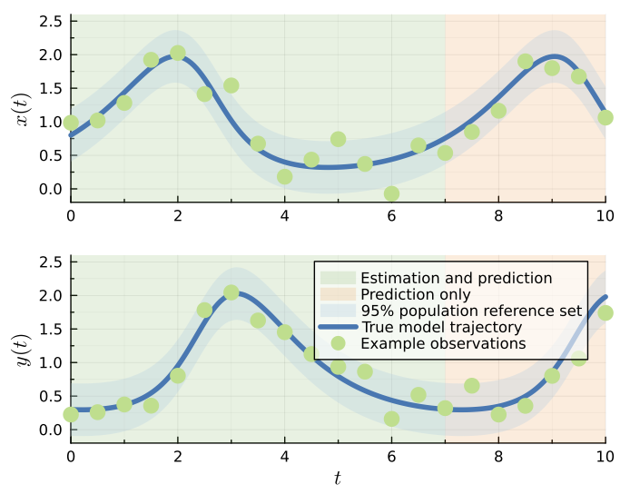
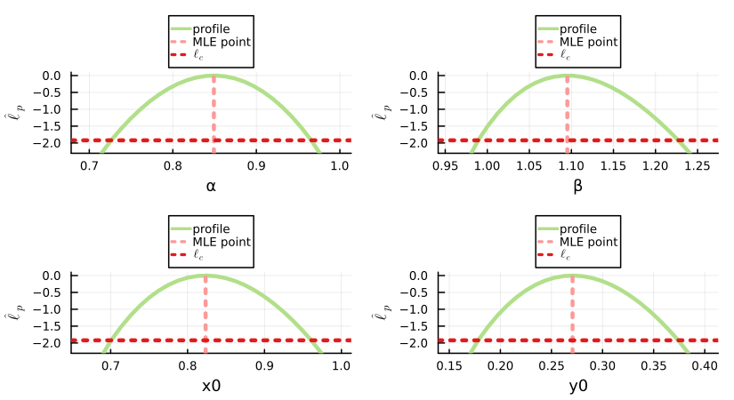
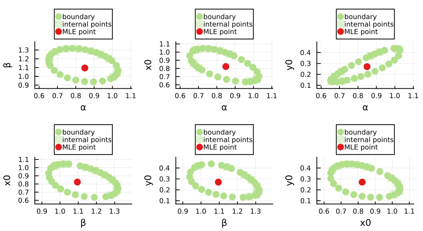
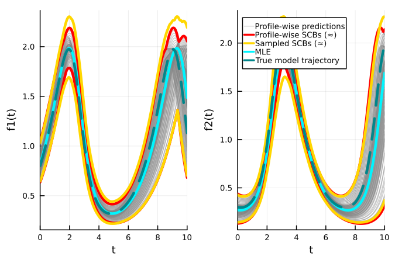
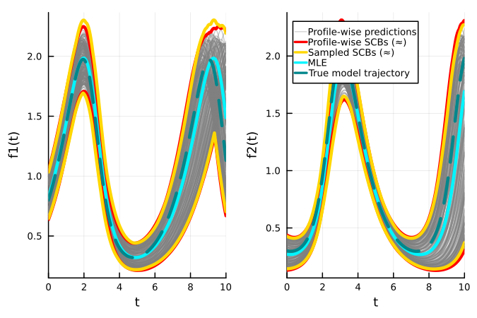
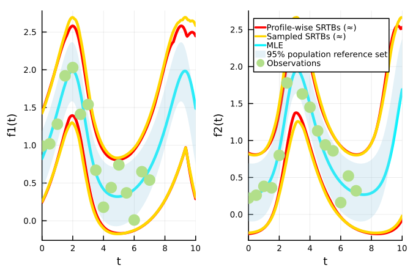
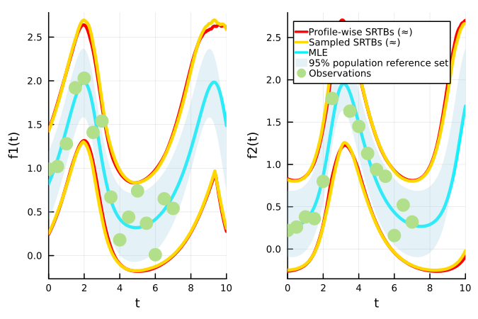

# Lotka-Volterra Model

The code included in this example is compiled into a single file [here](https://github.com/JoelTrent/LikelihoodBasedProfileWiseAnalysis.jl/blob/main/examples/lotka-volterra.jl).

The Lotka-Volterra model with a normal data distribution [simpsonprofilewise2023](@cite) has the following differential equations for the population size of the prey species ``x(t)`` and predator species ``y(t)``:

```math
    \frac{\mathrm{d}x(t)}{\mathrm{d}t} = \alpha x(t) - x(t)y(t),
```
```math
    \frac{\mathrm{d}y(t)}{\mathrm{d}t} = \beta x(t)y(t) - y(t),
```
where the model parameter vector is given by ``\theta^M = (\alpha, \beta, x(0), y(0))``. The corresponding additive Gaussian data distribution, with a fixed standard deviation, has a density function for the observed data given by: 
```math
    y_i \sim p(y_i ; \theta) \sim \mathcal{N}(z_i(\theta^M), \sigma^2 \mathbb{I}),
```
where  ``z_i(\theta^M)=z(t_i; \theta^M) = (x(t_i; \theta^M), y(t_i; \theta^M))`` is the model solution of the differential equations, meaning at each ``t_i`` we have an observation of both ``x(t)`` and ``y(t)``, ``y_i^\textrm{o}=(x_i^\textrm{o}, y_i^\textrm{o})``, ``\mathbb{I}`` is a ``2\times2`` identity matrix and ``\sigma=0.2``.

The true parameter values are ``\theta^M =(0.9, 1.1, 0.8, 0.3)``. The corresponding lower and upper parameter bounds are ``a = (0.7, 0.7, 0.5, 0.1)`` and ``b = (1.2, 1.4, 1.2, 0.5)``. Observation times are ``t_{1:I} = 0,0.5,1.0,...,7``. The times considered for predictions are extended up to ``t_I=10``. The original implementation can be found at [https://github.com/ProfMJSimpson/Workflow](https://github.com/ProfMJSimpson/Workflow). Example realisations, the true model trajectory and 95% population reference set under this parameterisation can be seen in the figure below:



## Initial Setup

Here we add six worker processes, which matches the number of bivariate profiles. For coverage testing we recommend setting this number as discussed in [Distributed Environment Setup](@ref). We're also using [StaticArrays](https://juliaarrays.github.io/StaticArrays.jl/stable/) to slightly speed up the differential equation solver.

```julia
using Distributed
if nprocs()==1; addprocs(6, env=["JULIA_NUM_THREADS"=>"1"]) end
@everywhere using Random, Distributions, DifferentialEquations, StaticArrays
@everywhere using LikelihoodBasedProfileWiseAnalysis
using Combinatorics
```

## Model and Likelihood Function Definition

In our ODE solver, we define the type of `tspan` using `eltype`. This is required to enable automatic differentiation to work correctly on the ODE function; we use this for computing the Fisher Information Matrix. For more information see [Native Julia solvers compatibility with autodifferentiation](https://docs.sciml.ai/DiffEqDocs/stable/basics/faq/#Native-Julia-solvers-compatibility-with-autodifferentiation).

```julia
@everywhere function lotka_static(C,p,t)
    dC_1=p[1]*C[1] - C[1]*C[2];
    dC_2=p[2]*C[1]*C[2] - C[2];
    SA[dC_1, dC_2]
end

@everywhere function odesolver(t,α,β,C01,C02)
    p=SA[α,β]
    C0=SA[C01,C02]
    tspan=eltype(p).((0.0,t[end]))
    prob=ODEProblem(lotka_static,C0,tspan,p)
    sol=solve(prob, AutoTsit5(Rosenbrock23()), saveat=t);
    return sol[1,:], sol[2,:]
end

@everywhere function ODEmodel(t,θ)
    return odesolver(t,θ[1],θ[2],θ[3],θ[4])
end

@everywhere function loglhood(θ, data)
    (y1, y2) = ODEmodel(data.t, θ)
    e=loglikelihood(data.dist, data.y_obs[:, 1] .- y1)  
    f=loglikelihood(data.dist, data.y_obs[:, 2] .- y2)
    return e+f
end
```

## Initial Data and Parameter Definition

```julia
# true parameters
α_true=0.9; β_true=1.1; x0_true=0.8; y0_true=0.3
@everywhere global σ=0.2
θ_true=[α_true, β_true, x0_true, y0_true]

t=LinRange(0,7,15)
y_true = hcat(ODEmodel(t, θ_true)...)
y_obs = [0.99 0.22; 1.02 0.26; 1.28 0.38; 1.92 0.36; 2.03 0.80; 1.41 1.78;
         1.54 2.04; 0.67 1.63; 0.18 1.45; 0.44 1.13; 0.74 0.94; 0.37 0.86;
         0.01 0.16; 0.65 0.52; 0.54 0.32]

# Named tuple of all data required within the log-likelihood function
data = (y_obs=y_obs, t=t, dist=Normal(0, σ))

# Bounds on model parameters 
αmin, αmax = (0.7, 1.2)
βmin, βmax = (0.7, 1.4)
x0min, x0max = (0.5, 1.2)
y0min, y0max = (0.1, 0.5)
lb_original = [αmin, βmin, x0min, y0min] .* 1.0
ub_original = [αmax, βmax, x0max, y0max] .* 1.0

αmin, αmax = (0.4, 1.5)
βmin, βmax = (0.7, 1.8)
x0min, x0max = (0.4, 1.3)
y0min, y0max = (0.02, 0.8)
lb = [αmin,βmin,x0min,y0min]
ub = [αmax,βmax,x0max,y0max]

θG = θ_true
θnames = [:α, :β, :x0, :y0]
par_magnitudes = [1,1,1,1]
```

## LikelihoodModel Initialisation

```julia
opt_settings = create_OptimizationSettings(solve_kwargs=(maxtime=5,))
model = initialise_LikelihoodModel(loglhood, data, θnames, θG, lb, ub, par_magnitudes, optimizationsettings=opt_settings)
```

## Full Parameter Vector Confidence Set Evaluation

To evaluate the full parameter vector confidence set at a 95% confidence level we use:

```julia
full_likelihood_sample!(model, 500000, use_distributed=true)
```

## Profiling

### Univariate Profiles

To find the confidence intervals for all three parameters at a 95% confidence level (the default), we use:

```julia
univariate_confidenceintervals!(model)
```

Similarly, if we wish to find simultaneous 95% confidence intervals for the parameters we set the degrees of freedom parameter, `dof`, to the number of model parameters (instead of `1`).

```julia
univariate_confidenceintervals!(model, dof=model.core.num_pars) # model.core.num_pars=4
```

We also evaluate some points within the intervals for the purposes of profile visualisation.

```julia
get_points_in_intervals!(model, 20, additional_width=0.2)
```

### Bivariate Profiles

To evaluate the bivariate boundaries for all six bivariate parameter combinations, here we use the [`IterativeBoundaryMethod`](@ref), which uses a 10 point ellipse approximation of the boundary as a starting guess using [`RadialMLEMethod`](@ref). The boundaries in this example are reasonably convex, which makes this starting guess appropriate. To speed up computation we provide stronger optimization settings.

```julia
opt_settings = create_OptimizationSettings(solve_kwargs=(maxtime=5, xtol_rel=1e-12))
bivariate_confidenceprofiles!(model, 30, 
    method=IterativeBoundaryMethod(20, 5, 5, 0.15, 1.0, use_ellipse=true), 
    optimizationsettings=opt_settings)
```

Similarly, if we wish to evaluate simultaneous 95% bivariate profiles we set the degrees of freedom parameter, `dof`, to the number of model parameters (instead of `2`).

```julia
opt_settings = create_OptimizationSettings(solve_kwargs=(maxtime=5, xtol_rel=1e-12))
bivariate_confidenceprofiles!(model, 30, 
    method=IterativeBoundaryMethod(20, 5, 5, 0.15, 1.0, use_ellipse=true), 
    dof=model.core.num_pars,
    optimizationsettings=opt_settings)
```

### Plots of Profiles

To visualise plots of these profiles we load [Plots](https://docs.juliaplots.org/stable/) alongside a plotting backend. Here we use [GR](https://github.com/jheinen/GR.jl).

```julia
using Plots, Plots.PlotMeasures; gr()
Plots.reset_defaults(); Plots.scalefontsizes(0.75)
```

Univariate and bivariate profiles can either be visualised individually or in comparison to profiles at the same confidence level and degrees of freedom. 

Here we plot the univariate profiles formed at a 95% confidence level and 1 degree of freedom.
```julia
plts = plot_univariate_profiles(model, confidence_levels=[0.95], dofs=[1])

plt = plot(plts..., layout=(2,2),
    legend=:outertop, title="", dpi=150, size=(550,300), margin=1mm)
display(plt)
```



Similarly, here we plot the simultaneous bivariate profiles formed at a 95% confidence level and 4 degrees of freedom.
```julia
plts = plot_bivariate_profiles(model, confidence_levels=[0.95], dofs=[model.core.num_pars])

plt = plot(plts..., layout=(2,3),
    legend=:outertop, title="", dpi=150, size=(550,300), margin=1mm)
display(plt)
```



## Predictions

To make predictions for the model trajectory and the ``1-\delta`` population reference set we define the following functions, which then need to be added to our [`LikelihoodModel`](@ref). The `region` variable in `errorfunction` should be set equal to ``1-\delta`` when generating predictions. These could also be added in [`initialise_LikelihoodModel`](@ref).

```julia
@everywhere function predictfunction(θ, data, t=data.t)
    y1, y2 = ODEmodel(t, θ) 
    y = hcat(y1,y2)
    return y
end

@everywhere function errorfunction(predictions, θ, region); normal_error_σ_known(predictions, θ, region, σ) end

add_prediction_function!(model, predictfunction)
add_error_function!(model, errorfunction)
```

To generate profile-wise predictions for each of the evaluated profiles we first define the desired time points for prediction and then evaluate the approximate model trajectory confidence sets and ``(1-\delta, 1-\alpha)`` population reference tolerance sets. By default, the population reference tolerance set evaluates reference interval regions at the same level as the default confidence level (``1-\delta = 1-\alpha = 0.95``); however, this is not required. We are making predictions outside the range of the data used to evaluate the profiles.

```julia
t_pred=LinRange(0,10,201)

generate_predictions_univariate!(model, t_pred)
generate_predictions_bivariate!(model, t_pred)
generate_predictions_dim_samples!(model, t_pred) # for the full likelihood sample
```

### Plotting Predictions

We can plot the predictions of individual profiles or the union of all profiles at a given number of interest parameters, confidence level, degrees of freedom and reference interval region (if relevant). When plotting the union of these predictions we can compare it to the result of the full likelihood sample, which here used [`LatinHypercubeSamples`](@ref), the default. Here we plot the results from simultaneous profiles.

#### Model Trajectory

```julia
model_trajectory = ODEmodel(t_pred, θ_true)
```

```julia
using Plots; gr()
plt=plot_predictions_union(model, t_pred, 1, dof=model.core.num_pars,
    compare_to_full_sample_type=LatinHypercubeSamples(), plot_title="") # univariate profiles

plot!(plt; dpi=150, size=(450, 300), xlims=(t_pred[1], t_pred[end]))
plot!(plt[1], t_pred, model_trajectory[1],
    lw=3, color=:turquoise4, linestyle=:dash)
plot!(plt[2], t_pred, model_trajectory[2],
    label="True model trajectory", lw=3, color=:turquoise4, linestyle=:dash)
```



```julia
plt=plot_predictions_union(model, t_pred, 2, dof=model.core.num_pars,
    compare_to_full_sample_type=LatinHypercubeSamples(), plot_title="") # bivariate profiles

plot!(plt; dpi=150, size=(450, 300), xlims=(t_pred[1], t_pred[end]))
plot!(plt[1], t_pred, model_trajectory[1],
    lw=3, color=:turquoise4, linestyle=:dash)
plot!(plt[2], t_pred, model_trajectory[2],
    label="True model trajectory", lw=3, color=:turquoise4, linestyle=:dash)
```



#### ``1-\delta`` Population Reference Set 

```julia
lq, uq = errorfunction(hcat(ODEmodel(t_pred, θ_true)...), θ_true, 0.95)
```

```julia
using Plots; gr()
plt = plot_realisations_union(model, t_pred, 1, dof=model.core.num_pars,
    compare_to_full_sample_type=LatinHypercubeSamples(), plot_title="") # univariate profiles

plot!(plt, t_pred, lq, fillrange=uq, fillalpha=0.3, linealpha=0,
    label="95% population reference set", color=palette(:Paired)[1])
scatter!(plt, data.t, data.y_obs, label="Observations", msw=0, ms=7, color=palette(:Paired)[3],
    xlims=(t_pred[1], t_pred[end]), dpi=150, size=(450, 300))
```



```julia
plt = plot_realisations_union(model, t_pred, 2, dof=model.core.num_pars, 
    compare_to_full_sample_type=LatinHypercubeSamples(), plot_title="") # bivariate profiles

plot!(plt, t_pred, lq, fillrange=uq, fillalpha=0.3, linealpha=0,
    label="95% population reference set", color=palette(:Paired)[1])
scatter!(plt, data.t, data.y_obs, label="Observations", msw=0, ms=7, color=palette(:Paired)[3],
    xlims=(t_pred[1], t_pred[end]), dpi=150, size=(450, 300))
```



## Coverage Testing

To conduct an investigation into the coverage properties of the profiles and profile-wise predictions sets we can perform a simulation study using the provided coverage functions. The procedures are effectively identical to those used for the [Logistic Model](@ref); the commentary for that example remains true for this example. 

### Data Generation

First we define functions and arguments which we use to simulate new training and testing data, and evaluate the true ``1-\delta`` population reference set, given the true parameter values. 

```julia
# DATA GENERATION FUNCTION AND ARGUMENTS
@everywhere function data_generator(θtrue, generator_args::NamedTuple)
    y_obs = generator_args.y_true .+ rand(generator_args.dist, length(generator_args.t), 2)
    if generator_args.is_test_set; return y_obs end
    data = (y_obs=y_obs, generator_args...)
    return data
end

@everywhere function reference_set_generator(θtrue, generator_args::NamedTuple, region::Float64)
    lq, uq = errorfunction(generator_args.y_true, θtrue, region)
    return (lq, uq)
end

training_gen_args = (y_true=y_true, t=t, dist=Normal(0, σ), is_test_set=false)
testing_gen_args = (y_true=hcat(ODEmodel(t_pred, θ_true)...), t=t_pred, dist=Normal(0, σ), is_test_set=true)
```

#### Parameter Confidence Intervals

Coverage of parameter confidence intervals:

```julia
opt_settings = create_OptimizationSettings(solve_kwargs=(maxtime=5, xtol_rel=1e-12))

uni_coverage_df = check_univariate_parameter_coverage(data_generator,
    training_gen_args, model, 1000, θ_true, collect(1:model.core.num_pars),
    optimizationsettings=opt_settings)
```

#### Bivariate Profiles

Coverage of the true value of each set of bivariate interest parameters:

```julia
opt_settings = create_OptimizationSettings(solve_kwargs=(maxtime=5, xtol_rel=1e-12))

biv_coverage_df = check_bivariate_parameter_coverage(data_generator,
    training_gen_args, model, 1000, 50, θ_true, 
    collect(combinations(1:model.core.num_pars, 2)),
    method = IterativeBoundaryMethod(20, 5, 5, 0.15, 0.1, use_ellipse=true), 
    optimizationsettings=opt_settings)
```

Coverage of the true bivariate boundary. 5000 samples corresponds to around 200-400 retained points:

```julia
opt_settings = create_OptimizationSettings(solve_kwargs=(maxtime=5, xtol_rel=1e-12))

biv_boundary_coverage_df = check_bivariate_boundary_coverage(data_generator,
    training_gen_args, model, 100, 30, 5000, θ_true,
    collect(combinations(1:model.core.num_pars, 2)); 
    method=IterativeBoundaryMethod(20, 5, 5, 0.15, 0.1, use_ellipse=true), 
    coverage_estimate_quantile_level=0.9,
    optimizationsettings=opt_settings)
```

### Prediction Coverage

#### Model Trajectory

To test the coverage of the true model trajectory we can use [`check_dimensional_prediction_coverage`](@ref), [`check_univariate_prediction_coverage`](@ref) and [`check_bivariate_prediction_coverage`](@ref). Again we use the default 95% confidence level here. Given a sufficient number of sampled points we expect the model trajectory coverage from the trajectory confidence set from propagating forward the full parameter vector 95% confidence set to have 95% simultaneous coverage. 

!!! danger "Using manual GC calls"
    On versions of Julia earlier than 1.10, we recommend setting the kwarg, `manual_GC_calls`, to true in each of the coverage functions. Otherwise the garbage collector may not successfully free memory every iteration leading to out of memory errors.

```julia
opt_settings = create_OptimizationSettings(solve_kwargs=(maxtime=5, xtol_rel=1e-12))

full_trajectory_coverage_df = check_dimensional_prediction_coverage(data_generator, 
    training_gen_args, t_pred, model, 1000, 500000, 
    θ_true, [collect(1:model.core.num_pars)])

uni_trajectory_coverage_df = check_univariate_prediction_coverage(data_generator, 
    training_gen_args, t_pred, model, 1000, 
    θ_true, collect(1:model.core.num_pars), 
    num_points_in_interval=20, 
    optimizationsettings=opt_settings)

biv_trajectory_coverage_df = check_bivariate_prediction_coverage(data_generator, 
    training_gen_args, t_pred, model, 1000, 30, θ_true, 
    collect(combinations(1:model.core.num_pars, 2)),
    method=IterativeBoundaryMethod(20, 5, 5, 0.15, 0.1, use_ellipse=true),
    optimizationsettings=opt_settings)
```

Repeating the coverage of univariate and bivariate profiles using the profile path approach:

```julia
uni_trajectory_coverage_df = check_univariate_prediction_coverage(data_generator, 
    training_gen_args, t_pred, model, 1000, 
    θ_true, collect(1:model.core.num_pars), 
    dof=model.core.num_pars,
    num_points_in_interval=20, 
    optimizationsettings=opt_settings)

biv_trajectory_coverage_df = check_bivariate_prediction_coverage(data_generator, 
    training_gen_args, t_pred, model, 1000, 30, θ_true, 
    collect(combinations(1:model.core.num_pars, 2)),
    dof=model.core.num_pars,
    method=IterativeBoundaryMethod(20, 5, 5, 0.15, 0.1, use_ellipse=true),
    optimizationsettings=opt_settings)
```

#### ``1-\delta`` Population Reference Set and Observations

To test the coverage of the ``1-\delta`` population reference set as well as observations we can use [`check_dimensional_prediction_realisations_coverage`](@ref), [`check_univariate_prediction_realisations_coverage`](@ref) and [`check_bivariate_prediction_realisations_coverage`](@ref). Here we will only look at the coverage for simultaneous profiles.

!!! danger "Using manual GC calls"
    On versions of Julia earlier than 1.10, we recommend setting the kwarg, `manual_GC_calls`, to true in each of the coverage functions. Otherwise the garbage collector may not successfully free memory every iteration leading to out of memory errors.

```julia
full_reference_coverage_df = check_dimensional_prediction_realisations_coverage(data_generator,
    reference_set_generator, training_gen_args, testing_gen_args, t_pred, model, 1000, 500000, 
    θ_true, [collect(1:model.core.num_pars)])

uni_reference_coverage_df = check_univariate_prediction_realisations_coverage(data_generator,
    reference_set_generator, training_gen_args, testing_gen_args, t_pred, model, 1000, 
    θ_true, collect(1:model.core.num_pars), 
    dof=model.core.num_pars,
    num_points_in_interval=20, 
    optimizationsettings=opt_settings)

biv_reference_coverage_df = check_bivariate_prediction_realisations_coverage(data_generator,
    reference_set_generator, training_gen_args, testing_gen_args, t_pred, model, 1000, 20, θ_true, 
    collect(combinations(1:model.core.num_pars, 2)),
    dof=model.core.num_pars,
    method=IterativeBoundaryMethod(20, 5, 5, 0.15, 0.1, use_ellipse=true),
    optimizationsettings=opt_settings)
```
