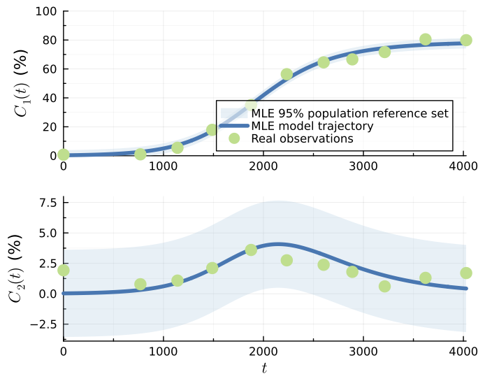
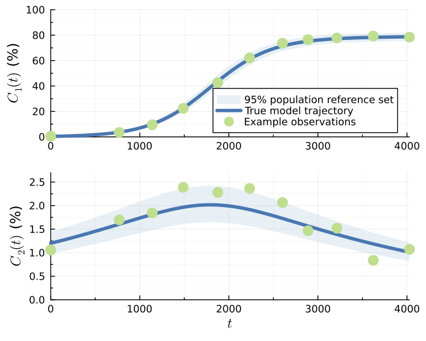

# Two-Species Logistic Model

The two-species logistic model with a Gaussian data distribution [simpsonprofile2023](@cite) has the following differential equations for the population densities of the two species ``C_1(t)\geq0`` and ``C_2(t)\geq0`` :
```math
    \frac{\mathrm{d}C(t)}{\mathrm{d}t} = \lambda_1 C_1(t) \Bigg[1-\frac{S(t)}{K}\Bigg],
```
```math
    \frac{\mathrm{d}C(t)}{\mathrm{d}t} = \lambda_2 C_2(t) \Bigg[1-\frac{S(t)}{K}\Bigg] - \delta C_2(t) \Bigg[\frac{C_1(t)}{K}\Bigg],
```
where ``S(t) = C_1(t)+C_2(t)``, and the full parameter vector is given by ``\theta = (\lambda_1, \lambda_2, K, \delta, C_1(0), C_2(0), \sigma)``. The corresponding additive Gaussian data distribution, with an estimated standard deviation, has a density function for the observed data given by:
```math
    y_i \sim p(y_i ; \theta) \sim \mathcal{N}(z_i(\theta^M), \theta^\textrm{o} \mathbb{I}) \sim \mathcal{N}(z_i(\theta^M), \sigma^2_N \mathbb{I}) ,
```
where ``\theta^M = (\lambda_1, \lambda_2, K, \delta, C_1(0), C_2(0))``, ``\theta^\textrm{o} = \sigma``, ``z_i(\theta^M)=z(t_i; \theta^M) = (C_1(t_i; \theta^M), C_2(t_i; \theta^M))`` from the previous equations, meaning at each ``t_i`` we have an observation of both ``C_1(t)`` and ``C_2(t)``, ``y_i^\textrm{o}=(C_{1,\,i}^\textrm{o}, C_{2,\,i}^\textrm{o})``, and ``\mathbb{I}`` is a ``2\times2`` identity matrix.

This model uses real data, so no 'true' parameter values exist. Instead, the MLE values of parameters are used for coverage simulations ``\hat{\theta} =(0.00293, 0.00315, 0.00164, 78.8, 0.289, 0.0293, 1.83)``. The corresponding lower and upper parameter bounds are ``a = (0.0001, 0.0001, 0, 60, 0.01, 0.001, 0.1)`` and ``b = (0.01, 0.01, 0.01, 90, 1, 1, 3)``; the lower bounds for all the parameters apart from ``\delta`` were zero [simpsonprofile2023](@cite) but were increased slightly to increase stability. Observation times are ``t_{1:I} = (0, 769, 1140, 1488, 1876, 2233, 2602, 2889, 3213, 3621, 4028)``. Smaller nuisance parameter bounds are used for univariate profiles, although they are wider than those used in [simpsonprofile2023](@cite): ``a_{\text{nuisance},j} =\max(a_j,\, \hat{\theta}_j\div2.5 ), \, j \in 1,2,...,7`` and ``b_{\text{nuisance},j} =\min(b_j,\, \hat{\theta}_j\times2.5 ), \, j \in 1,2,...,7``. The original implementation can be found at [https://github.com/ProfMJSimpson/profile_predictions](https://github.com/ProfMJSimpson/profile_predictions).

Real observations, the MLE model trajectory and the MLE 95% population reference set under this parameterisation can be seen in the figure below:



## With Logit-Normal Data Distribution

If we instead use a more statistically realistic logit-normal distribution, defined on (0,1), instead of an additive Gaussian data distribution, the density function for the observed data becomes:
```math
    y_i \sim \text{LogitNormal}(\text{logit}(z_i(\theta^M)), \sigma^2\mathbb{I}).
```
where ``\theta^M = (\lambda_1, \lambda_2, K, \delta, C_1(0), C_2(0))``, ``\theta^\textrm{o} = \sigma`` and ``\text{logit}(p)=\log(p\div (1-p))``. The model trajectory, ``z_i(\theta^M)``, is assumed to be a proportion ``\in (0,1)``.

The 'true' parameter values used for coverage simulations are similar to the MLE values of the parameters when using this data distribution, albeit with a lower value of ``\sigma``: ``\theta = (0.003, 0.0004, 0.0004, 80.0, 0.4, 1.2, 0.1)``. Parameter bounds have been adjusted slightly to ``a = (0.0005, 0.00001, 0.00001, 60, 0.01, 0.1, 0.01)`` and ``b = (0.01, 0.005, 0.005, 98, 2, 3, 1)`` and no 'special' nuisance parameter bounds are specified.

For coverage testing of predictive quantities using the sampled full parameter confidence set, we use much more well-informed parameter bounds that may be overly constrained: ``a_\text{sampling} = (0.0022, 0.00001, 0.0001, 73, 0.25, 0.7, 0.03)`` and ``b_\text{sampling} = (0.0036, 0.001, 0.0009, 85, 0.65, 2, 0.2)``.

Example observations, the true model trajectory and the 95% population reference set under this parameterisation can be seen in the figure below:



## Initial Setup

Here we add 10 worker processes, given a PC with 12 CPU threads and 32GB RAM. For coverage testing we recommend setting this number as discussed in [Import Package and Set Up Distributed Environment](@ref). We also use [LogExpFunctions](https://juliastats.org/LogExpFunctions.jl/stable/) to define the `logit` function.

```julia
using Distributed
if nprocs()==1; addprocs(10, env=["JULIA_NUM_THREADS"=>"1"]) end
@everywhere using Random, Distributions, DifferentialEquations
@everywhere using LogExpFunctions
@everywhere using PlaceholderLikelihood
using Combinatorics
```

## Model and Likelihood Function Definition

Here, we will use the logit-normal data distribution. The Gaussian distribution can be used by changing the distribution used in the log-likelihood function, as seen for the [Logistic Model](@ref) and [Lotka-Volterra Model](@ref) examples.

The logit-normal distribution expects a proportion and our data and model produce a percentage so we are required to divide these through by 100.

```julia
@everywhere function DE!(dC, C, p, t)
    λ1, λ2, δ, KK = p
    S = C[1] + C[2]
    dC[1] = λ1 * C[1] * (1.0 - S/KK)
    dC[2] = λ2 * C[2] * (1.0 - S/KK) - δ*C[2]*C[1]/KK
end

@everywhere function odesolver(t, λ1, λ2, δ, KK, C01, C02)
    p=(λ1, λ2, δ, KK)
    C0=[C01, C02]
    tspan=(0.0, maximum(t))
    prob=ODEProblem(DE!, C0, tspan, p)
    sol=solve(prob, saveat=t)
    return sol[1,:], sol[2,:]
end

@everywhere function ODEmodel(t, θ)
    (y1, y2) = odesolver(t, θ[1], θ[2], θ[3], θ[4], θ[5], θ[6])
    return y1, y2
end

@everywhere function loglhood(θ, data)
    (y1, y2) = ODEmodel(data.t, θ)
    e=0.0
    for i in axes(data.y_obs,1)
        e += (loglikelihood(LogitNormal(logit(y1[i]/100.), θ[7]), data.y_obs[i,1]/100.) + 
                loglikelihood(LogitNormal(logit(y2[i]/100.), θ[7]), data.y_obs[i,2]/100.))
    end
    return e
end
```

## Initial Data and Parameter Definition

```julia
# true data
t=[0, 769, 1140, 1488, 1876, 2233, 2602, 2889, 3213, 3621, 4028]
data11=[0.748717949, 0.97235023, 5.490243902, 17.89100529, 35, 56.38256703, 64.55087666, 66.61940299, 71.67362453, 80.47179487, 79.88291457]
data12=[1.927065527, 0.782795699, 1.080487805, 2.113227513, 3.6, 2.74790376, 2.38089652, 1.8, 0.604574153, 1.305128205, 1.700502513]

# true parameters used for coverage testing
θ_true = [0.003, 0.0004, 0.0004, 80.0, 0.4, 1.2, 0.1]
y_true = hcat(ODEmodel(t, θ_true)...)

# Named tuple of all data required within the log-likelihood function
data = (y_obs=hcat(data11,data12), t=t)

# Bounds on model parameters 
lb_sample = [0.0022, 0.00001, 0.0001, 73.0, 0.25, 0.7, 0.03]
ub_sample = [0.0036,  0.001, 0.0009, 85., 0.65, 2.0, 0.2]

lb = [0.0005, 0.00001, 0.00001, 60.0, 0.01, 0.1, 0.01]
ub = [0.01, 0.005, 0.005, 98.0, 2.0, 3.0, 1.0]

λ1g=0.002; λ2g=0.002; δg=0.001; KKg=80.0; C0g=[1.0, 1.0]; σg=0.5
θG = [λ1g, λ2g, δg, KKg, C0g[1], C0g[2], σg]

θnames = [:λ1, :λ2, :δ, :K, :C01, :C02, :σ]
par_magnitudes = [0.001, 0.001, 0.001, 10, 1, 1, 1]
```

## LikelihoodModel Initialisation

Here we define a single [`LikelihoodModel`](@ref) for sampling and profiling of parameter confidence sets. We will use [`setbounds!`](@ref) to switch between the bounds for profiling and sampling.

```julia
opt_settings = create_OptimizationSettings(solve_kwargs=(maxtime=5,))
model = initialise_LikelihoodModel(loglhood, data, θnames, θG, lb, ub, par_magnitudes, optimizationsettings=opt_settings)
```

## Full Parameter Vector Confidence Set Evaluation

To evaluate the full parameter vector confidence set at a 95% confidence level we use the following. Note the use of [`setbounds!`](@ref) to adjust the bounds contained in `model` from those used for sampling back to those appropriate for profiling. 

```julia
setbounds!(model, lb=lb_sample, ub=ub_sample)
full_likelihood_sample!(model, Int(1e7), use_distributed=true)
setbounds!(model, lb=lb, ub=ub)
```

## Profiling

### Univariate Profiles

To find the confidence intervals for all seven parameters at a 95% confidence level (the default), we use:

```julia
univariate_confidenceintervals!(model)
```

Similarly, if we wish to find simultaneous 95% confidence intervals for the parameters we set the degrees of freedom parameter, `dof`, to the number of model parameters (instead of `1`).

```julia
univariate_confidenceintervals!(model, dof=model.core.num_pars) # model.core.num_pars=7
```

### Bivariate Profiles

To evaluate the bivariate boundaries for all 21 bivariate parameter combinations, here we use the [`RadialMLEMethod`](@ref), which uses a 20 point ellipse approximation of the boundary as a starting guess. The boundaries in this example are reasonably convex, which makes this starting guess appropriate. To speed up computation we provide stronger optimization settings.

```julia
opt_settings = create_OptimizationSettings(solve_kwargs=(maxtime=5, xtol_rel=1e-12))
bivariate_confidenceprofiles!(model, 20, 
    method=RadialMLEMethod(0.15, 0.01),
    optimizationsettings=opt_settings)
```

Similarly, if we wish to evaluate simultaneous 95% bivariate profiles we set the degrees of freedom parameter, `dof`, to the number of model parameters (instead of `2`).

```julia
opt_settings = create_OptimizationSettings(solve_kwargs=(maxtime=5, xtol_rel=1e-12))
bivariate_confidenceprofiles!(model, 20, 
    method=RadialMLEMethod(0.15, 0.01), 
    dof=model.core.num_pars,
    optimizationsettings=opt_settings)
```

### Plots of Profiles

To visualise plots of these profiles we load [Plots](https://docs.juliaplots.org/stable/) alongside a plotting backend. Here we use [GR](https://github.com/jheinen/GR.jl).

```julia
using Plots; gr()
```

Univariate and bivariate profiles can either be visualised individually or in comparison to profiles at the same confidence level and degrees of freedom. 

Here we plot the first three univariate profiles formed at a 95% confidence level and 1 degree of freedom.
```julia
plts = plot_univariate_profiles(model, θs_to_plot=[1,2,3],
    confidence_level=0.95, dof=1)

plt = plot(plts..., layout=(1,3))
display(plt)
```

Similarly, here we plot the first three simultaneous bivariate profiles formed at a 95% confidence level and 7 degrees of freedom.
```julia
plts = plot_bivariate_profiles(model, θcombinations_to_plot=[[1,2], [1,3], [1,4]],
    confidence_level=0.95, dof=model.core.num_pars)

plt = plot(plts..., layout=(1,3))
display(plt)
```

## Predictions

To make predictions for the model trajectory and the ``1-\delta`` population reference set we define the following functions, which then need to be added to our [`LikelihoodModel`](@ref). The `region` variable in `errorfunction` should be set equal to ``1-\delta`` when generating predictions. These could also be added in [`initialise_LikelihoodModel`](@ref).

```julia
@everywhere function predictfunction(θ, data, t=data.t)
    y1, y2 = ODEmodel(t, θ) 
    y = hcat(y1,y2)
    return y
end

@everywhere function errorfunction(predictions, θ, region)
    lq, uq = logitnormal_error_σ_estimated(predictions ./ 100, θ, region, 7)
    lq .= lq .* 100
    uq .= uq .* 100
    return lq, uq
end

add_prediction_function!(model, predictfunction)
add_error_function!(model, errorfunction)
```

To generate profile-wise predictions for each of the evaluated profiles we first define the desired time points for prediction and then evaluate the approximate model trajectory confidence sets and ``(1-\delta, 1-\alpha)`` population reference tolerance sets. By default, the population reference tolerance set evaluates reference interval regions at the same level as the default confidence level (``1-\delta = 1-\alpha = 0.95``); however, this is not required. 

```julia
t_pred=LinRange(t[1], t[end], 201)

generate_predictions_univariate!(model, t_pred)
generate_predictions_bivariate!(model, t_pred)
generate_predictions_dim_samples!(model, t_pred) # for the full likelihood sample
```
### Plotting Predictions

We can plot the predictions of individual profiles or the union of all profiles at a given number of interest parameters, confidence level, degrees of freedom and reference interval region (if relevant). When plotting the union of these predictions we can compare it to the result of the full likelihood sample, which here used [`LatinHypercubeSamples`](@ref), the default. Here we plot the results from simultaneous profiles.

#### Model Trajectory

```julia
using Plots; gr()
plot_predictions_union(model, t_pred, 1, dof=model.core.num_pars,
    compare_to_full_sample_type=LatinHypercubeSamples()) # univariate profiles
```

```julia
plot_predictions_union(model, t_pred, 2, dof=model.core.num_pars,
    compare_to_full_sample_type=LatinHypercubeSamples()) # bivariate profiles
```

#### ``1-\delta`` Population Reference Set 

```julia
using Plots; gr()
plot_realisations_union(model, t_pred, 1, dof=model.core.num_pars,
    compare_to_full_sample_type=LatinHypercubeSamples()) # univariate profiles
```

```julia
plot_realisations_union(model, t_pred, 2, dof=model.core.num_pars, 
    compare_to_full_sample_type=LatinHypercubeSamples()) # bivariate profiles
```

## Coverage Testing

To conduct an investigation into the coverage properties of the profiles and profile-wise predictions sets we can perform a simulation study using the provided coverage functions. The procedures are effectively identical to those used for the [Logistic Model](@ref); the commentary for that example remains similar for this example, however coverage may be lower than expected due to too few observations. 

!!! danger "Computational time of these tests"
    The computational time of several of the below tests is up to 4 hrs with 10 worker processes on the author's pc.

### Data Generation

First we define functions and arguments which we use to simulate new training and testing data, and evaluate the true ``1-\delta`` population reference set, given the true parameter values. 

```julia
# DATA GENERATION FUNCTION AND ARGUMENTS
@everywhere function data_generator(θtrue, generator_args::NamedTuple)
    y_obs = zeros(size(generator_args.y_true))
    for i in eachindex(generator_args.y_true)
        y_obs[i] = rand(LogitNormal(logit(generator_args.y_true[i]/100.), θtrue[7]))
    end
    y_obs .= y_obs .* 100
    if generator_args.is_test_set; return y_obs end
    data = (y_obs=y_obs, generator_args...)
    return data
end

@everywhere function reference_set_generator(θtrue, generator_args::NamedTuple, region::Float64)
    lq, uq = errorfunction(generator_args.y_true, θtrue, region)
    return (lq, uq)
end

training_gen_args = (y_true=y_true, t=t, is_test_set=false)
testing_gen_args = (y_true=predictfunction(θ_true, data, t_pred), t=t_pred, is_test_set=true)
```

#### Parameter Confidence Intervals

Coverage of parameter confidence intervals:

```julia
opt_settings = create_OptimizationSettings(solve_kwargs=(maxtime=5, xtol_rel=1e-12))

uni_coverage_df = check_univariate_parameter_coverage(data_generator,
    training_gen_args, model, 1000, θ_true, collect(1:model.core.num_pars),
    optimizationsettings=opt_settings)
```

#### Bivariate Profiles

Coverage of the true value of each set of bivariate interest parameters:

```julia
opt_settings = create_OptimizationSettings(solve_kwargs=(maxtime=5, xtol_rel=1e-12))

biv_coverage_df = check_bivariate_parameter_coverage(data_generator,
    training_gen_args, model, 1000, 30, θ_true, 
    collect(combinations(1:model.core.num_pars, 2)),
    method = RadialMLEMethod(0.15, 0.1), 
    optimizationsettings=opt_settings)
```

Coverage of the true bivariate boundary. 2000 samples corresponds to around 100-200 retained points:

```julia
opt_settings = create_OptimizationSettings(solve_kwargs=(maxtime=5, xtol_rel=1e-12))

biv_boundary_coverage_df = check_bivariate_boundary_coverage(data_generator,
    training_gen_args, model, 100, 30, 2000, θ_true,
    collect(combinations(1:model.core.num_pars, 2)); 
    method = RadialMLEMethod(0.15, 0.1), 
    coverage_estimate_quantile_level=0.9,
    optimizationsettings=opt_settings)
```

### Prediction Coverage

#### Model Trajectory

To test the coverage of the true model trajectory we can use [`check_dimensional_prediction_coverage`](@ref), [`check_univariate_prediction_coverage`](@ref) and [`check_bivariate_prediction_coverage`](@ref). Again we use the default 95% confidence level here. Given a sufficient number of sampled points we expect the model trajectory coverage from the trajectory confidence set from propagating forward the full parameter vector 95% confidence set to have 95% simultaneous coverage. 

!!! danger "Using manual GC calls"
    On versions of Julia earlier than 1.10, we recommend setting the kwarg, `manual_GC_calls`, to true in each of the coverage functions. Otherwise the garbage collector may not successfully free memory every iteration leading to out of memory errors.

```julia
opt_settings = create_OptimizationSettings(solve_kwargs=(maxtime=5, xtol_rel=1e-12))

setbounds!(model, lb=lb_sample, ub=ub_sample)
full_trajectory_coverage_df = check_dimensional_prediction_coverage(data_generator, 
    training_gen_args, t_pred, model, 200, Int(1e7), 
    θ_true, [collect(1:model.core.num_pars)])
setbounds!(model, lb=lb, ub=ub)

uni_trajectory_coverage_df = check_univariate_prediction_coverage(data_generator, 
    training_gen_args, t_pred, model, 1000, 
    θ_true, collect(1:model.core.num_pars),
    optimizationsettings=opt_settings)

biv_trajectory_coverage_df = check_bivariate_prediction_coverage(data_generator, 
    training_gen_args, t_pred, model, 1000, 30, θ_true, 
    collect(combinations(1:model.core.num_pars, 2)),
    method=RadialMLEMethod(0.15, 0.1),
    optimizationsettings=opt_settings)
```

Repeating the coverage of univariate and bivariate profiles using the profile path approach:

```julia
uni_trajectory_coverage_df = check_univariate_prediction_coverage(data_generator, 
    training_gen_args, t_pred, model, 1000, 
    θ_true, collect(1:model.core.num_pars), 
    dof=model.core.num_pars,
    optimizationsettings=opt_settings)

biv_trajectory_coverage_df = check_bivariate_prediction_coverage(data_generator, 
    training_gen_args, t_pred, model, 1000, 30, θ_true, 
    collect(combinations(1:model.core.num_pars, 2)),
    dof=model.core.num_pars,
    method=RadialMLEMethod(0.15, 0.1),
    optimizationsettings=opt_settings)
```

#### ``1-\delta`` Population Reference Set and Observations

To test the coverage of the ``1-\delta`` population reference set as well as observations we can use [`check_dimensional_prediction_realisations_coverage`](@ref), [`check_univariate_prediction_realisations_coverage`](@ref) and [`check_bivariate_prediction_realisations_coverage`](@ref). Here we will only look at the coverage for simultaneous profiles.

!!! danger "Using manual GC calls"
    On versions of Julia earlier than 1.10, we recommend setting the kwarg, `manual_GC_calls`, to true in each of the coverage functions. Otherwise the garbage collector may not successfully free memory every iteration leading to out of memory errors.

```julia
full_reference_coverage_df = check_dimensional_prediction_realisations_coverage(data_generator,
    reference_set_generator, training_gen_args, testing_gen_args, t_pred, model, 200, Int(1e7), 
    θ_true, [collect(1:model.core.num_pars)])

uni_reference_coverage_df = check_univariate_prediction_realisations_coverage(data_generator,
    reference_set_generator, training_gen_args, testing_gen_args, t_pred, model, 1000, 
    θ_true, collect(1:model.core.num_pars), 
    dof=model.core.num_pars, 
    optimizationsettings=opt_settings)

biv_reference_coverage_df = check_bivariate_prediction_realisations_coverage(data_generator,
    reference_set_generator, training_gen_args, testing_gen_args, t_pred, model, 1000, 30, θ_true, 
    collect(combinations(1:model.core.num_pars, 2)),
    dof=model.core.num_pars,
    method=RadialMLEMethod(0.15, 0.1),
    optimizationsettings=opt_settings)
```
